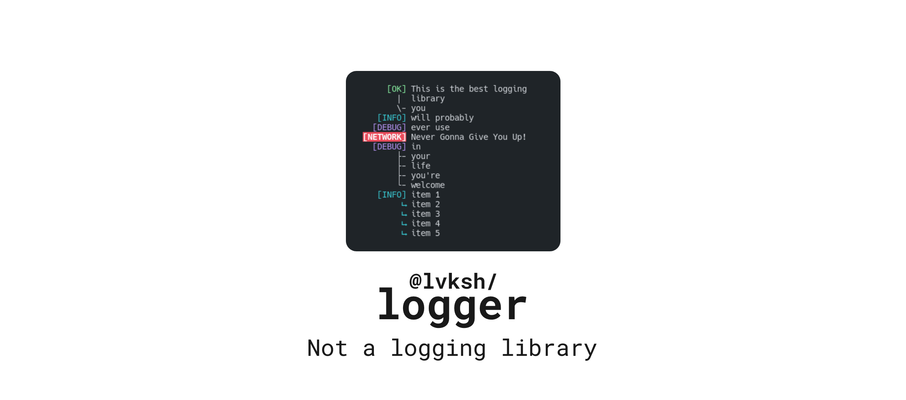
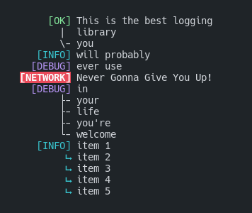

## Table of Contents

- [Installation](#installation)
- [Usage](#usage)
  * [example](#usage) (To get you going)
  * [LoggerConfig](#loggerconfig) (Customization for the entire logger)
  * [MethodConfig](#methodconfig) (Customization on a per-method basis)

## Installation

Using `npm`:

```sh
npm install @lvksh/logger
```

or if you prefer to use the `yarn` package manager:

```sh
yarn add @lvksh/logger
```

## Usage

Get started by creating your logger

```ts
import { createLogger } from '@lvksh/logger';
import chalk from 'chalk';

const log = createLogger(
    {
        ok: {label: chalk.greenBright`[OK]`,newLine: '| ', newLineEnd: '\\-'},
        debug: chalk.magentaBright`[DEBUG]`,
        info: {
            label: chalk.cyan`[INFO]`,
            newLine: chalk.cyan`⮡`,
            newLineEnd: chalk.cyan`⮡`,
        },
        veryBigNetworkError: chalk.bgRed.white.bold`[NETWORK]`,
    },
    { padding: "PREPEND"},
    console.log
);
```

And now log to your hearts content

```ts
log.ok("This is the best logging", "library", "you");
log.info("will probably");
log.debug("ever use");
log.veryBigNetworkError`Never Gonna Give You Up!`;
log.debug("in", "your", "life", "you're", "welcome");
log.info("item 1", "item 2", "item 3", "item 4", "item 5");
```

Which produces the following result

<center>
    
</center>

### LoggerConfig

This section is still work in progress.

### MethodConfig

This section is still work in progress.

## Contributors
[](https://github.com/lvkdotsh/logger/graphs/contributors)